# Blueprint — an AI project agent for DIY retail, by WalletLoop

> *"I want a 4 × 3 m deck in the garden."*
> → a 3D blueprint of **their** deck, the complete shopping list with exact quantities,
> **their** price with WalletLoop offers applied, points earned, which store has it all in stock,
> a step-by-step plan and the best weather window to build it. In ~10 seconds.

Blueprint runs inside a retailer's app or straight from a link on the customer's **WalletLoop
wallet pass** (no app install needed — the pass already knows who the member is). It is
white-label: the same build demos as a neutral retailer ("Atelier"), as HORNBACH
(`?retailer=hornbach`) or any other DIY chain on WalletLoop.

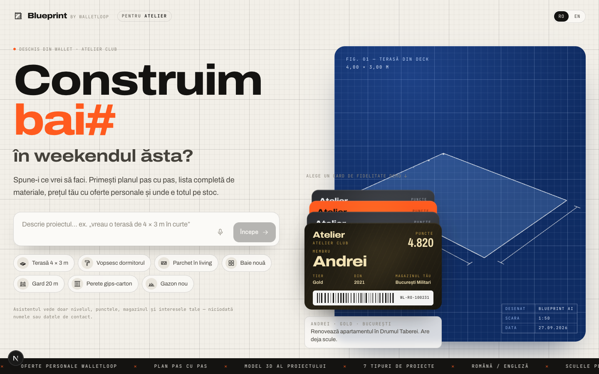

| Live project board | Shopping list, offers & stock |
|---|---|
| 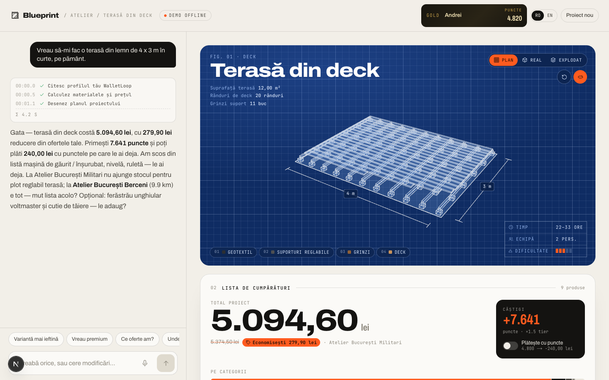 | 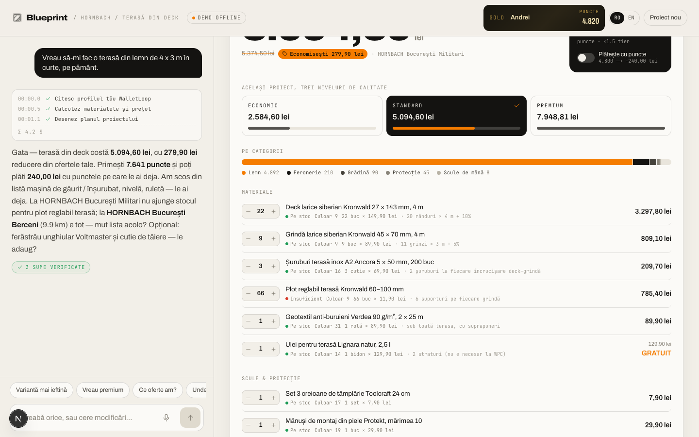 |
| **Exploded 3D view** | **Plan, tips & safety** |
| 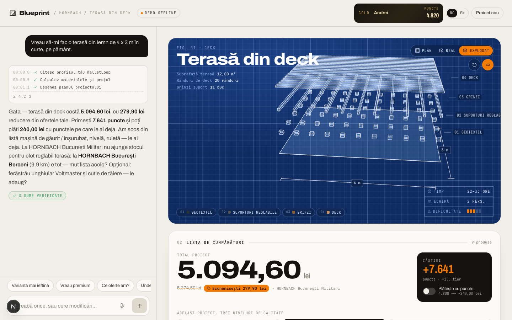 | 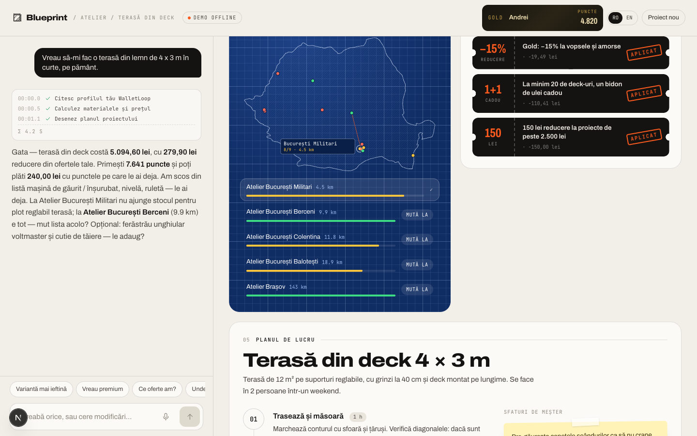 |
| **Stock map & WalletLoop offers** | **List on the wallet pass, sorted by aisle** |
| 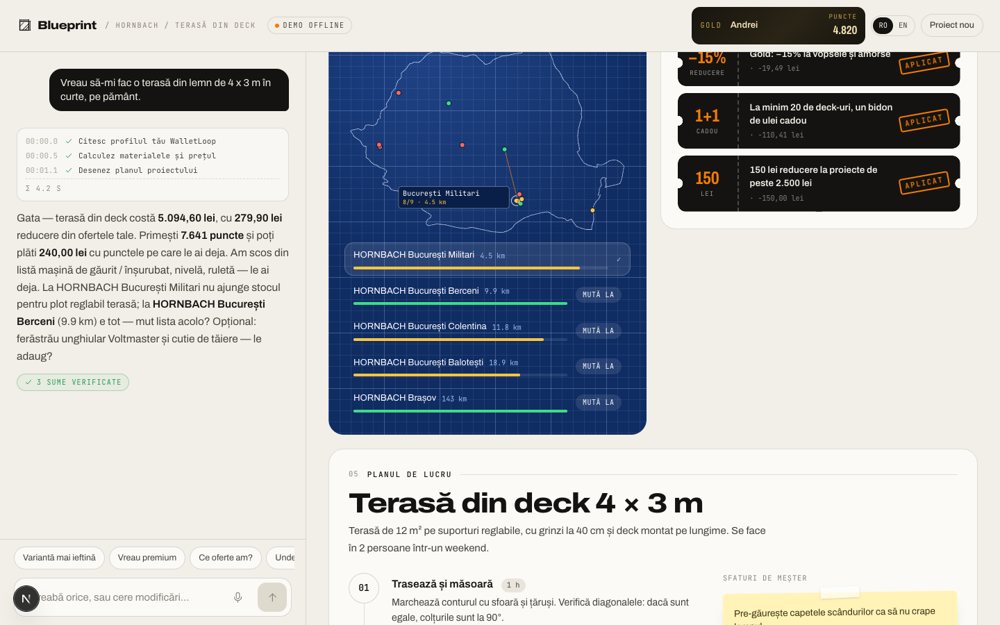 | 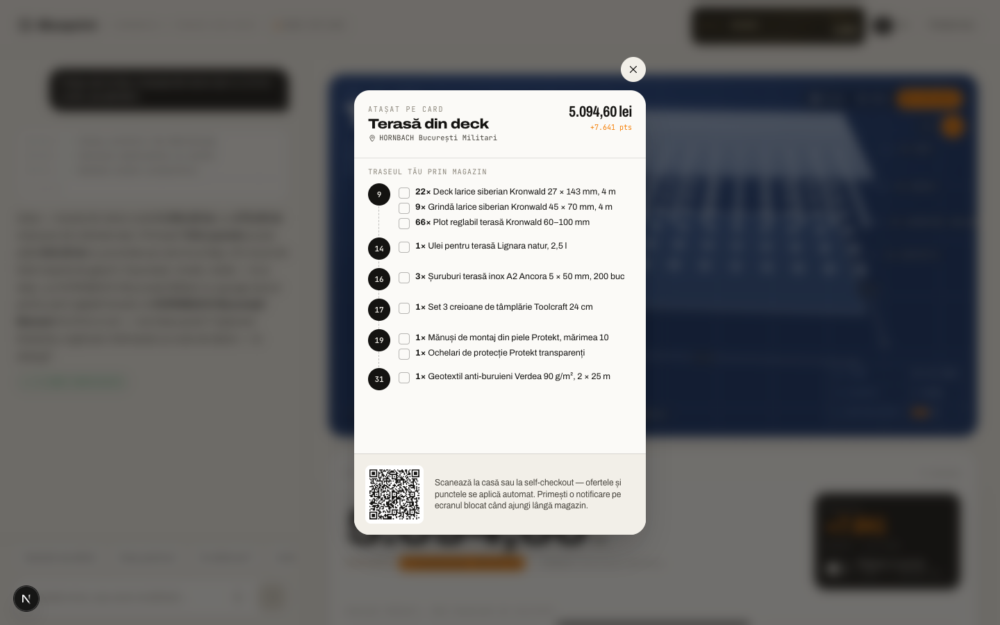 |
| **Best days to build (live forecast)** | |
| 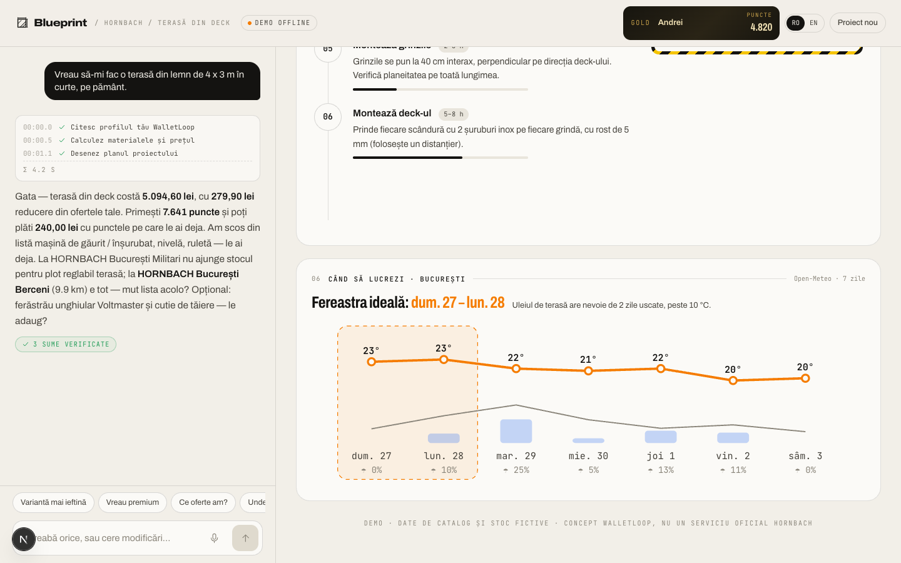 | |

---

## Quick start

```bash
npm install
cp .env.example .env.local        # add OPENAI_API_KEY (optional — see offline mode)
npm run dev                        # http://localhost:3000
```

| URL | What you get |
|---|---|
| `/` | Neutral demo retailer "Atelier" |
| `/?retailer=hornbach` | HORNBACH white-label (name, colour, store names) |
| `/?retailer=brico` | A third example tenant |
| `/?demo=1` | Starts in **offline demo mode** (no LLM calls, instant, deterministic) |
| `/?member=WL-RO-204518` | Opens with a specific demo member |
| `/pitch?retailer=hornbach` | **Pitch page** for a retailer: problem, live project numbers, how it works, trust, ROI calculator, pilot plan (`&lang=en` for English) |

Live deployment (offline demo mode until an `OPENAI_API_KEY` is added in Vercel):
**https://blueprint-walletloop.vercel.app** · pitch: **https://blueprint-walletloop.vercel.app/pitch?retailer=hornbach**

**Offline demo mode.** If there is no API key, the model is rate-limited, or you toggle the
header badge (`AI live` ↔ `Demo offline`), a rule-based agent takes over. It uses **the same
tools** (real calculations, prices, stock, offers), hand-written plans and replies built from the
quote — perfect for pitching on bad Wi-Fi. Fallback is automatic if the LLM fails before
streaming.

## The 3-minute pitch demo

1. **Pick a pass** — four WalletLoop members: Andrei (Gold, renovating, already owns tools),
   Maria (Silver, garden lover), James (Bronze, expat, English), Elena (**no personalisation
   consent** — shows GDPR-respecting behaviour).
2. Andrei → **"Terasă 4 × 3 m"**. Watch the construction log, the deck assemble in 3D (supports
   → joists → boards), the price count up.
3. Point at: *owned tools skipped* ("you bought a drill in March"), *Gold −15 % on paint*,
   *free decking oil bundle*, *150 lei project discount*, *+7.641 points*, *supports short at
   Militari → Berceni has everything, 9.9 km → one tap to move*.
4. Toggle **Real / Exploded** views; hover a shopping-list line to highlight that layer in 3D.
5. Tap **Economic / Standard / Premium** — the same project priced three ways, switched instantly.
6. **"Trimite lista în Wallet"** — the pass flips over: the list sorted by aisle (a walking
   route through the store), tick-off boxes, a QR for the till.
7. Scroll: plan with durations, pro tips, hazard-striped safety box, **7-day weather window**
   (live Open-Meteo forecast, best days to build).
8. Quick replies: *"Variantă mai ieftină"*, *"Ce oferte am?"* (coupons with personal reasons),
   *"Unde e totul pe stoc?"* (Romania stock map). Note the **"✓ N amounts verified"** badge
   under every answer.
9. **Reshape the project.** Say *"Fă-o în L cu o extindere de 2 × 2 m în dreapta"* or *"Adaugă 3
   trepte în față și ridic-o la 50 cm"* — or tap **Modifică** and drag an edge / tap **+** on the
   plan. Only what changed builds in 3D (new parts glow, removed ones sink away in red), the list
   is recalculated keeping the products you picked, and a receipt shows every material and the
   price difference (**Anulează** undoes it). Raising the deck swaps in taller pedestals by itself.
10. **Change anything by talking.** *"Alege varianta din WPC și arată-mi-o în vedere reală"* — the
    boards switch (re-sized for the project) and the 3D turns grey WPC; *"Arată-mi grinzile"*
    lifts and highlights the joists; *"Scoate geotextilul"*, *"Adaugă sugestiile"*, *"Mută lista la
    Berceni"*, *"Plătesc cu puncte"*, *"Anulează"* all work (live AI and offline).
11. **Don't know the size?** *"Vreau o terasă dar nu știu cât de mare"* → typical sizes to tap and a
    pace counter (1 pace ≈ 75 cm). Reload the page: the start screen offers **"Continuă proiectul"**.
12. Switch to Maria → **"Gazon nou"** (garden ×3 points), James → **"New bathroom"** in English,
   Elena → no personalisation consent. Try the mic button (voice, ro-RO / en-GB).
13. Close with **/pitch?retailer=hornbach** — the ROI calculator and the 6-week pilot plan.

## How it works

```
 Wallet pass link / retailer app
            │
            ▼
 ┌──────────────────────┐   NDJSON stream: status · text · cards · state
 │  Next.js UI (React)  │◀───────────────────────────────────────────┐
 │  rail + live board   │                                            │
 └──────────┬───────────┘                                            │
            │ POST /api/chat {message, history, state}               │
            ▼                                                        │
 ┌──────────────────────┐  tools   ┌──────────────────────────────┐  │
 │ Agent loop           │─────────▶│ Domain (pure, tested)        │  │
 │ OpenAI Responses API │          │  calculators → resolver →    │  │
 │  or scripted agent   │◀─────────│  quote engine (offers,points,│──┘
 └──────────────────────┘  JSON    │  stock, alternatives)        │
                                   └──────────────┬───────────────┘
                                                  │ adapters
                     ┌────────────────┬───────────┴───┬──────────────────┐
                     ▼                ▼               ▼                  ▼
                 Catalogue        Inventory        Stores          WalletLoop loyalty
               (retailer API)   (retailer API)  (retailer API)   (members, offers, pass)
```

**The LLM never does maths and never invents products.** It gathers the customer's intent and
dimensions, calls tools, and explains results. Everything with a number comes from code:

| Layer | File | Responsibility |
|---|---|---|
| Calculators | `src/domain/calculators.ts` | 7 project types → material requirements by *role* (e.g. `18.4 l interior_paint`), with waste factors and the reasoning shown to the customer |
| Resolver | `src/domain/resolve.ts` | Role → product line by quality tier and spec match; cheapest pack-size combination (15 l + 5 l beats 2 × 10 l); skips tools the member already owns |
| Quote engine | `src/domain/quote.ts` | Line totals, best single offer per line, bundles, basket thresholds, loyalty points (tier + category multipliers), redemption cap, stock at chosen store, alternatives, delivery |
| Offers | `src/domain/offers.ts` | Eligibility by tier, segment, member, validity — targeted offers only with personalisation consent |
| Layout | `src/domain/layout.ts` | The editable sketch per project (zones, steps, openings, fence corners/gates), validated edit ops, geometry helpers |
| Look | `src/domain/look.ts` | How the chosen products look in 3D (colour, board width, tile format…) from catalogue specs |
| Sizes | `src/domain/sizes.ts` | Typical sizes, measuring tips and the pace estimator for customers who don't know their measurements |
| Agent tools | `src/agent/tools.ts` | `get_customer_context`, `calculate_project`, `edit_sketch`, `modify_basket`, `control_view`, `suggest_sizes`, `search_products`, `check_stock`, `get_offers`, `present_plan` |
| Agent loop | `src/agent/run.ts`, `llm.ts` | Streaming tool-use loop behind a provider-neutral `LlmClient` interface |
| Scripted agent | `src/agent/scripted.ts` | Offline RO/EN intent parser + same tools, used as fallback |
| Verification | `src/agent/verify.ts` | Every lei amount in the model's reply must exist in the quote; failing replies are replaced by the deterministic one |
| 3D | `src/components/blueprint/` | Procedural assemblies drawn from the layout, animated build and edit diffs, blueprint/real/exploded views, 2D plan editor |

Conversation state (basket, store, project) is round-tripped by the client, so the server is
stateless and horizontally scalable; history and state from the browser are validated before reuse
(`src/agent/state.ts`).

### The assistant can change everything on screen

The model has the same powers as the customer's fingers, and sees the live list (including hand edits)
in its instructions:

| Customer says | Tool |
|---|---|
| "WPC instead of larch", "fewer screws", "remove the saw", "add the oil", "move it to Berceni" | `modify_basket` — `choose` re-sizes the new option for the project; suggestions live in session state (add / dismiss) |
| "L-shape", "3 steps at the front", "a gate", "undo" | `edit_sketch` (with layout history) |
| "show me the joists", "exploded view", "open the cart", "pay with points", "open the plan editor" | `control_view` → a `ui` event the client applies (sketch view/highlight, panels, cart, product sheet) |
| "I don't know the size" | `suggest_sizes` → typical sizes + pace estimator |

**Fast first answer.** Before the model starts, the server loads the member profile and, when the
message clearly describes a complete project, calculates it deterministically: the sketch and
the priced list are on screen in under a second, and both results are handed to the model as
tool calls it already made — it only writes the plan and the reply (2 requests instead of 3–4).
If the model fails after that, the turn completes from the template plan and the quote.

**The sketch shows the actual products** (`src/domain/look.ts`): board width/colour, joist
section, tile format (incl. wood-look planks in running bond), laminate decor, paint colour,
panel/gate material — straight from catalogue specs. Swapping an option re-draws the sketch
(same part ids → the change morphs and glows). Why not real 3D models of each SKU: retailers
rarely have them, image-to-3D isn't dimensionally reliable, and the sketch is mostly boards,
tiles and panels whose look is fully described by their specs; hero products can get a GLB later.

**Saved sessions.** The project is kept in the customer's browser (per retailer + member, 30 days);
the start screen offers to continue it.

**Plans.** `tenant.plans`: `"ai"` (demo) lets the model write the step-by-step plan, marked as AI;
`"approved"` always shows the retailer-reviewed template, with the model's tips in a separate
AI section.

### The editable sketch

Every project has a **layout** (`src/domain/layout.ts`) — zones (L/U shapes), deck height and steps,
fence corners and gates, doors/windows, per-wall tile heights. It is the single source of truth:
the calculators compute quantities from it and the 3D builders draw it, so the sketch and the
shopping list can't disagree.

- Edits are validated `SketchOp`s (`resize`, `add_zone`, `add_steps`, `set_height`, `add_opening`,
  `add_fence_segment`, `set_wall_tiles`, `set_option`, …) with a readable change log.
- The agent uses them through the **`edit_sketch`** tool; the plan editor posts the same ops to
  **`/api/sketch`** (no LLM call — instant and free). Both keep the customer's product picks
  (unless they no longer fit, e.g. pedestals after raising a deck), leave out what they removed and
  return a **change card**: per-material difference and the price delta, which the verifier accepts.
- The 3D scene diffs part ids between builds, so an edit animates only new/resized/removed parts,
  and the camera glides instead of jumping.
- **When to sketch** is per retailer: `sketch: "auto"` draws every project (demos), `"on_demand"`
  shows a light card with a *Schițează proiectul* button and only builds the 3D when asked
  (production — most people just want the list). Override with `?sketch=auto|on_demand`.
- Cost: hand edits cost nothing (deterministic); an edit by chat is one normal agent turn.

### Your own plans and models

Customers can bring their own files into the sketch: **Încarcă** in the sketch controls or in the plan
editor's header, or drop a file on the sketch (phones: the Schiță tab). Files are opened **in the
browser and stay on the device** — nothing is uploaded, except the optional AI read below.

- **3D model** — GLB, single-file glTF or OBJ, ≤ 30 MB and ≤ 500k triangles, parsed with three.js'
  own loaders. glTF that points at external files or needs Draco/KTX2 decoders is refused, and only
  `data:`/`blob:` URLs are ever loaded. It is drawn as context around the sketch (translucent blue
  with one merged edge overlay in the blueprint views, its own materials in the real view) and never
  explodes, animates or changes the camera fit. Dock controls: units (guessed from the bounding box:
  > 200 → mm, > 20 → cm, else m), turn 90°, move ±0.1 / ±1 m, on the ground, opacity, hide, remove.
- **Architect's plan** — PNG, JPG, WebP or the first page of a PDF (pdf.js, rendered locally). It
  sits under the plan editor. *Calibrează*: tap both ends of a known dimension and type the real
  distance; then *Aliniază* (drag), turn 90°, opacity, hide. Once calibrated it is also laid on the
  ground of the 3D sketch (toggle *3D*).
- **Read the sizes with AI** (optional) — only shown when an OpenAI key is configured and
  `AGENT_MODE` isn't `scripted` (`GET /api/plan-read`). One downscaled JPEG (≤ 1.5 MB) goes to
  `POST /api/plan-read` (Responses API, image input, strict JSON schema, `store: false`, per-visitor
  limit `PLAN_READS_PER_10_MIN`, pass session required in product mode, the image is never logged).
  Rooms come back as chips marked *citite de AI — verifică-le*; tapping one sends a normal chat
  message ("Baie 3,2 × 2,4 m"), so nothing is applied without the customer.
- **Storage** — IndexedDB `blueprint-uploads` / `files`, keys `${tenant}:${memberId}:{model|plan}:{meta|blob}`
  (blob = the file, meta = placement / calibration / AI reading). The meta carries the id of the
  conversation's first message, which the saved session keeps: a reload or *Continuă* brings the
  files back, a new project doesn't inherit them, and *forget my project* deletes them.
- **Code** — `src/lib/uploads/*` (checks, units, calibration, IndexedDB, loaders, store) and
  `src/components/blueprint/{UserModel,PlanGround,PlanUnderlay,PlanCalibrator,ModelControls,PlanControls}.tsx`
  + `blueprint/uploads/*`. The sketch only exposes two hooks: `Scene`'s `extra` and `PlanEditor`'s
  `underlay` props. Samples: `docs/samples/house.glb`, `docs/samples/plan-baie.png`
  (`npx tsx scripts/make-upload-samples.ts`).

| Own 3D model (real view) | Calibrated plan + AI-read size sent to the chat | Phone (Schiță tab) |
| --- | --- | --- |
| 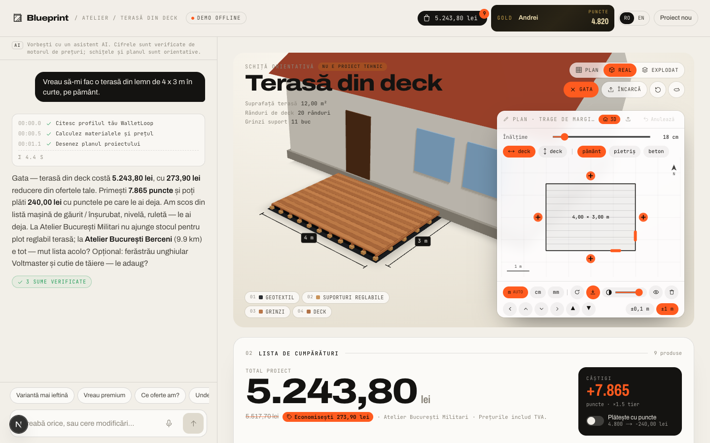 | 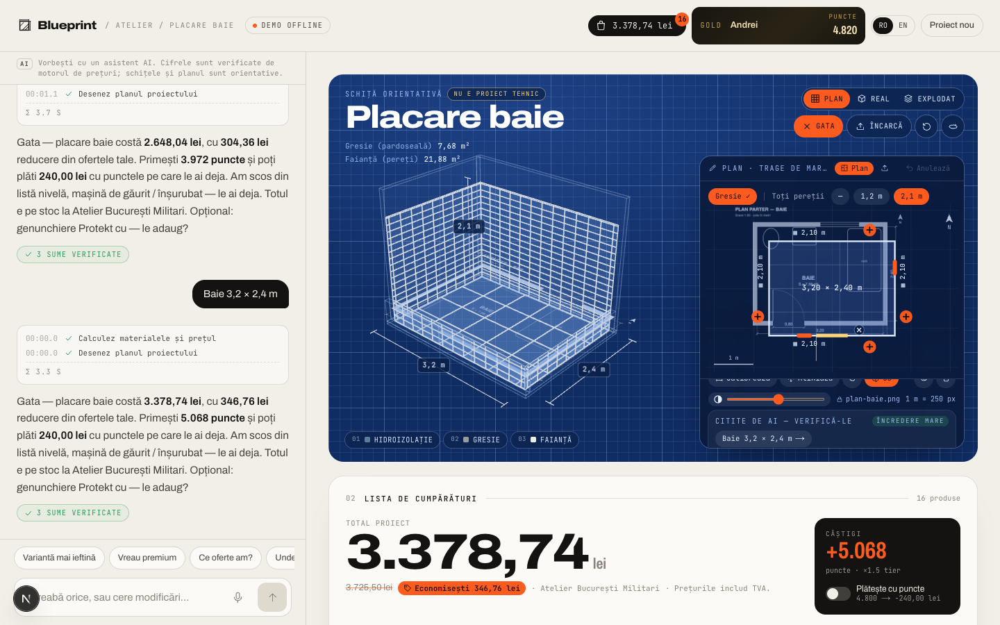 | 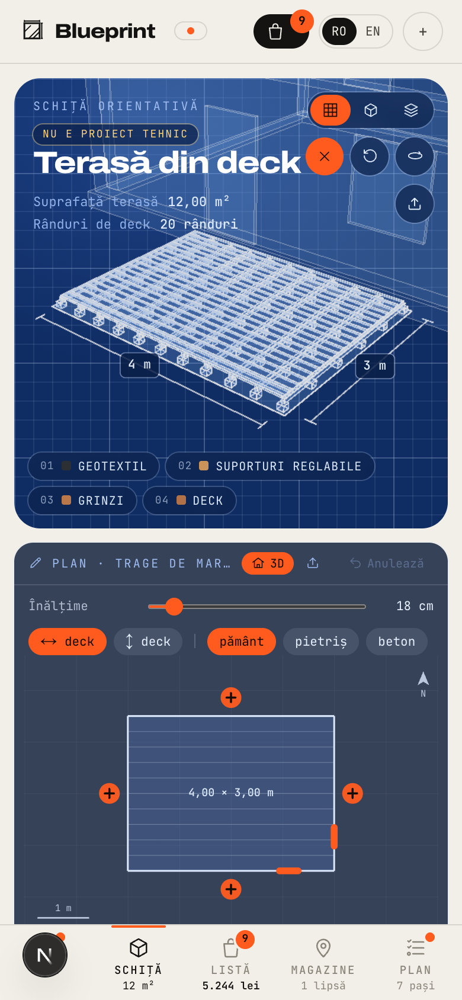 |

## Integrating the real systems

Everything the agent touches goes through four interfaces in `src/adapters/types.ts`:

```ts
CatalogProvider   get · getMany · search · byRoles
InventoryProvider stock(storeIds, skus)            // batch
StoreProvider     list
LoyaltyProvider   getMember · getOffers            // WalletLoop
```

- **WalletLoop** — `src/adapters/walletloop.ts` is a ready skeleton for the WalletLoop REST API
  (`DATA_SOURCE=walletloop`); adjust the two mappers to the final payloads.
- **Retailer catalogue/stock** — implement the three providers against the retailer's product
  and store-inventory APIs. The only extra data the agent needs is a **role tag** per product
  (e.g. `deck_board`, `tile_adhesive`) plus `content` (how much one sales unit provides) and a
  coverage spec for paints/oils/seed. That mapping is typically a one-off enrichment job over
  the retailer's category tree.
- Demo data lives in `src/data/` (255 products with fictional brands, 11 stores modelled on a
  Romanian DIY network, deterministic stock, 10 WalletLoop offers, 4 personas).

## Production entry: signed pass links

In the demo anyone can pick one of the four members. In production the customer never says who
they are: they tap the Blueprint link on their wallet pass. Set `REQUIRE_PASS_LINK=1` and
`PASS_LINK_SECRET` (≥ 32 characters, shared with WalletLoop's pass backend) to switch it on.
Without `REQUIRE_PASS_LINK` the demo behaves exactly as before.

1. **Pass → signed link.** WalletLoop's pass backend puts `https://…/?retailer=<tenant>&t=<token>` on
   the pass, where `token = v1.<base64url(payload)>.<base64url(HMAC-SHA256(secret, "v1.<base64url(payload)>"))>`
   and `payload = { m: memberId, t: tenantId, exp: unixSeconds, l?: "ro"|"en", n?: nonce }`
   (`src/lib/passToken.ts`).
2. **Link → cookie.** `src/proxy.ts` (Next 16's replacement for middleware) runs only on page requests
   carrying `t`. It checks the signature (constant-time), expiry (60 s clock skew) and that the token's
   tenant is the page's retailer, then sets an httpOnly, SameSite=Lax session cookie (Secure and
   `__Host-` prefixed in production, path `/`) and redirects to the same URL without `t`, so the token
   never stays in the address bar or history. The cookie holds a separate session token (derived key,
   never valid as a link) that expires with the link, at most after 12 h. A bad or expired link clears
   any older session and shows a "open it again from your card" note.
3. **Cookie → routes.** The page renders only that member's pass (no picker); without a session it asks
   the customer to open Blueprint from their card in Wallet. Every API route resolves the member via
   `memberFromRequest()` / `sessionFromRequest()` in `src/lib/session.ts`: the `memberId` the browser
   sends is ignored, a missing/invalid session (or one for another tenant) gets **401**, and
   `/api/members` returns only the session's member.

Mint a link by hand (what the pass backend does; base URL from `PUBLIC_BASE_URL`, default `http://localhost:3100`):

```bash
npx tsx --env-file=.env.local scripts/make-pass-link.ts WL-RO-204518 hornbach 24   # <memberId> [tenant] [hours]
```

Tokens are bearer credentials: they are never logged (only the rejection reason is). The nonce `n`
lets the pass backend track or revoke individual links; the app does not keep server-side state.

## Privacy & safety

- **Data minimisation**: the model sees tier, points, home store, city, interests and
  purchase history — never name, email, phone or exact location. No personalisation consent →
  no interests/history and no targeted offers. No location consent → only home store is used.
- `store: false` on every model call; history lives in the customer's browser.
- For EU production, run the model in-region (Azure OpenAI EU, or Claude via AWS Bedrock
  Frankfurt / Google Vertex EU) — the `LlmClient` interface is the only thing to swap.
- Safety rules in the prompt and calculators: electrics, gas, structural walls, work at height
  → licensed professional; hazard notes per project.

### Price display (EU / Romanian consumer law)

The quote engine (`src/domain/quote.ts`) does the maths; the list and cart only render it.

- **Prior price on reductions** (Omnibus, Directive 98/6/EC art. 6a): a crossed-out price is
  only ever the product's **lowest price of the last 30 days** (`Product.lowestPrice30d`, never
  above today's price), labelled "Cel mai mic preț din ultimele 30 de zile". If an offer does not
  beat it, the line shows its price with nothing struck through, and the basket's "you save"
  (`quote.saving`) is measured from those references. The retailer adapter must supply
  `lowestPrice30d`; the demo derives it from a seeded history in `src/data/priceHistory.ts`.
- **Personalised prices** (Consumer Rights Directive art. 6(1)(ea)): tier (above entry), segment
  and member-targeted offers are personalised (`isPersonalisedOffer`), badged on the line and
  disclosed in the list and cart footers; offers open to every member are not flagged.
- **Unit price** per l / kg / m / m² (per piece for multi-packs) next to pack products, from the
  list price; none when it equals the selling price.
- **VAT**: all prices include VAT, stated next to the totals.

## Scripts

```bash
npm test                     # 67 unit tests: calculators, pack optimiser, quote engine, offers, scripted agent
npm run typecheck
npm run validate:catalog     # catalogue integrity (roles, units, tiers, fictional brands)
npx tsx scripts/inspect-project.ts deck '{"lengthM":4,"widthM":3}' WL-RO-100231 premium
npx tsx --env-file=.env.local scripts/try-agent.ts "Vreau o terasă de 4x3 m" WL-RO-100231
npx tsx --env-file=.env.local scripts/make-pass-link.ts WL-RO-100231 hornbach 24   # signed pass link
npm run eval                 # live-model scenarios with automatic accuracy checks
```

## Configuration

See `.env.example`. Key ones: `OPENAI_API_KEY`, `OPENAI_MODEL` (default `gpt-5.4-mini`),
`AGENT_MODE=scripted`, `TENANT`, `DATA_SOURCE`. Per retailer (`src/config/tenant.ts`): brand,
colours, loyalty programme name and `sketch: "auto" | "on_demand"` (demo tenant: auto; HORNBACH and
Brico Nord: on demand).

> **Note on the current OpenAI key:** the account is on a low usage tier (≈50 requests/day
> for `gpt-5.4-mini`, 3 req/min for `gpt-5.5`). One customer turn uses 3–4 requests. Add a
> payment method / raise the tier before live demos — or demo in offline mode.

## Roadmap to production

1. Real catalogue/stock/store adapters + role-tagging job for the retailer's assortment.
2. WalletLoop API mappers + push the shopping list to the wallet pass (back-of-pass field +
   lock-screen notification near the store — WalletLoop already does geo-triggered pushes).
3. Click & Collect reservation via the retailer's order API.
4. More project types (roof insulation, kitchen, wardrobes, irrigation) — each is a calculator,
   a 3D builder and a plan template.
5. Analytics: basket size uplift vs. control, conversion to reservation, offer redemption.
6. Eval suite in CI (`scripts/eval.ts`) with a larger scenario set.
